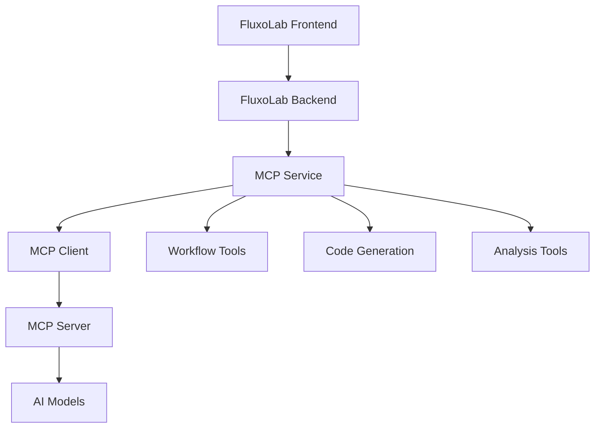

# 🤖 MCP (Model Context Protocol) - Introdução

O MCP (Model Context Protocol) é uma integração avançada que permite ao FluxoLab aproveitar o poder da inteligência artificial para automação, análise e geração de workflows.

## 🎯 O que é o MCP?

O Model Context Protocol é um padrão que permite que aplicações se conectem com modelos de IA de forma padronizada, fornecendo:

- **Ferramentas**: Funções que a IA pode executar
- **Recursos**: Dados que a IA pode acessar
- **Prompts**: Templates para geração de conteúdo

## 🚀 Funcionalidades Principais

### 1. **Geração de Código**
- Criação automática de workflows
- Geração de scripts de automação
- Código personalizado em múltiplas linguagens

### 2. **Análise de Workflows**
- Análise de complexidade
- Identificação de gargalos
- Sugestões de otimização

### 3. **Validação Inteligente**
- Verificação de workflows
- Detecção de problemas
- Recomendações de melhoria

### 4. **Documentação Automática**
- Geração de documentação
- Criação de guias de uso
- Diagramas de fluxo

### 5. **Simulação de Workflows**
- Teste de cenários
- Análise de performance
- Predição de resultados

## 🏗️ Arquitetura



### Componentes

#### **MCP Service**
- Gerencia conexões com servidores MCP
- Expõe funcionalidades via API REST
- Integra com sistema de workflows

#### **MCP Client**
- Comunica com servidores MCP externos
- Gerencia autenticação e sessões
- Trata erros e reconexões

#### **MCP Tools Service**
- Implementa ferramentas específicas do FluxoLab
- Geração de código e análise
- Integração com workflows

## 🔧 Configuração

### Variáveis de Ambiente

```env
# MCP Configuration
MCP_SERVER_URL=https://your-mcp-server.com
MCP_API_KEY=your_mcp_api_key
```

### Servidor MCP Recomendado

O FluxoLab é compatível com qualquer servidor MCP que implemente o protocolo padrão. Recomendamos:

- **Claude Desktop** (Anthropic)
- **OpenAI GPT-4**
- **Servidores MCP personalizados**

## 📋 Ferramentas Disponíveis

### 1. **execute_workflow_step**
Executa um passo específico de workflow com contexto fornecido.

```javascript
{
  "name": "execute_workflow_step",
  "description": "Executa um passo de workflow com contexto",
  "parameters": {
    "stepId": "string",
    "context": "object"
  }
}
```

### 2. **generate_code**
Gera código para workflows ou automações.

```javascript
{
  "name": "generate_code",
  "description": "Gera código para workflows",
  "parameters": {
    "description": "string",
    "language": "string",
    "type": "workflow|automation|integration"
  }
}
```

### 3. **analyze_workflow**
Analisa workflows existentes para insights.

```javascript
{
  "name": "analyze_workflow",
  "description": "Analisa workflows para insights",
  "parameters": {
    "definition": "object"
  }
}
```

### 4. **validate_workflow**
Valida workflows para erros e problemas.

```javascript
{
  "name": "validate_workflow",
  "description": "Valida workflows",
  "parameters": {
    "definition": "object"
  }
}
```

### 5. **optimize_workflow**
Otimiza workflows para melhor performance.

```javascript
{
  "name": "optimize_workflow",
  "description": "Otimiza workflows",
  "parameters": {
    "definition": "object"
  }
}
```

## 🎨 Recursos Disponíveis

### 1. **workflow_templates**
Biblioteca de templates de workflows.

```javascript
{
  "uri": "fluxolab://templates/ecommerce",
  "name": "E-commerce Workflow Template",
  "description": "Template para automação de e-commerce",
  "mimeType": "application/json"
}
```

### 2. **integration_examples**
Exemplos de integrações.

```javascript
{
  "uri": "fluxolab://examples/whatsapp",
  "name": "WhatsApp Integration Example",
  "description": "Exemplo de integração com WhatsApp",
  "mimeType": "application/json"
}
```

### 3. **best_practices**
Documentação de melhores práticas.

```javascript
{
  "uri": "fluxolab://docs/best-practices",
  "name": "Best Practices Guide",
  "description": "Guia de melhores práticas",
  "mimeType": "text/markdown"
}
```

## 📝 Prompts Disponíveis

### 1. **workflow_designer**
Gera designs de workflows baseados em descrições.

```javascript
{
  "name": "workflow_designer",
  "description": "Designs workflows baseado em descrições",
  "arguments": {
    "business_process": "string",
    "requirements": "array",
    "constraints": "array"
  }
}
```

### 2. **code_reviewer**
Revisa código de workflows.

```javascript
{
  "name": "code_reviewer",
  "description": "Revisa código de workflows",
  "arguments": {
    "code": "string",
    "language": "string",
    "focus_areas": "array"
  }
}
```

### 3. **documentation_generator**
Gera documentação para workflows.

```javascript
{
  "name": "documentation_generator",
  "description": "Gera documentação",
  "arguments": {
    "workflow_definition": "object",
    "format": "markdown|html|pdf",
    "audience": "developer|user|admin"
  }
}
```

## 🚀 Casos de Uso

### 1. **Automação de E-commerce**
```javascript
// Gerar workflow para processamento de pedidos
const workflow = await mcpService.generateWorkflowCode(
  "Processar pedidos de e-commerce: validar estoque, calcular frete, enviar confirmação",
  "javascript"
);
```

### 2. **Análise de Performance**
```javascript
// Analisar workflow existente
const analysis = await mcpService.analyzeWorkflow(workflowDefinition);
console.log(analysis.complexity); // 'high'
console.log(analysis.potentialIssues); // ['bottleneck detected']
```

### 3. **Geração de Documentação**
```javascript
// Gerar documentação automaticamente
const docs = await mcpService.generateDocumentation(workflowDefinition);
```

### 4. **Otimização Automática**
```javascript
// Otimizar workflow
const optimized = await mcpService.optimizeWorkflow(workflowDefinition);
console.log(optimized.improvements); // ['Reduced API calls', 'Added caching']
```

## 🔒 Segurança

### Autenticação
- API Keys para servidores MCP
- JWT tokens para autenticação de usuários
- Rate limiting para prevenir abuso

### Validação
- Validação de entrada em todas as ferramentas
- Sanitização de dados
- Verificação de permissões

### Logs
- Log de todas as operações MCP
- Auditoria de uso
- Monitoramento de performance

## 📊 Monitoramento

### Métricas Disponíveis
- Número de chamadas MCP
- Tempo de resposta das ferramentas
- Taxa de sucesso/erro
- Uso por usuário

### Alertas
- Falhas de conexão com MCP
- Tempo de resposta alto
- Erros de autenticação
- Uso excessivo de recursos

## 🔗 Integração com Frontend

### Componentes Vue.js
```vue
<template>
  <div class="mcp-integration">
    <McpWorkflowGenerator @generate="handleGenerate" />
    <McpWorkflowAnalyzer :workflow="currentWorkflow" />
    <McpCodeReviewer :code="workflowCode" />
  </div>
</template>

<script setup>
import { McpWorkflowGenerator, McpWorkflowAnalyzer, McpCodeReviewer } from '@/components/mcp';

const handleGenerate = async (description) => {
  const result = await mcpService.generateWorkflowCode(description);
  // Processar resultado
};
</script>
```

## 🚀 Próximos Passos

1. **[Configuração](./setup.md)**: Como configurar MCP no FluxoLab
2. **[Uso](./usage.md)**: Como usar as ferramentas MCP
3. **[Ferramentas](./tools.md)**: Lista completa de ferramentas disponíveis
4. **[Exemplos](./examples.md)**: Exemplos práticos de uso

---

**O MCP transforma o FluxoLab em uma plataforma verdadeiramente inteligente, capaz de entender, analisar e otimizar workflows automaticamente.**
